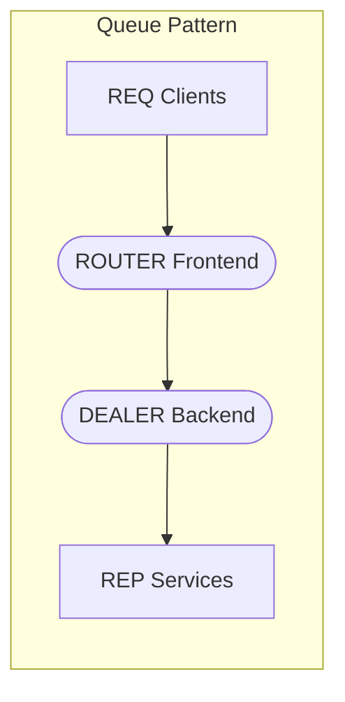
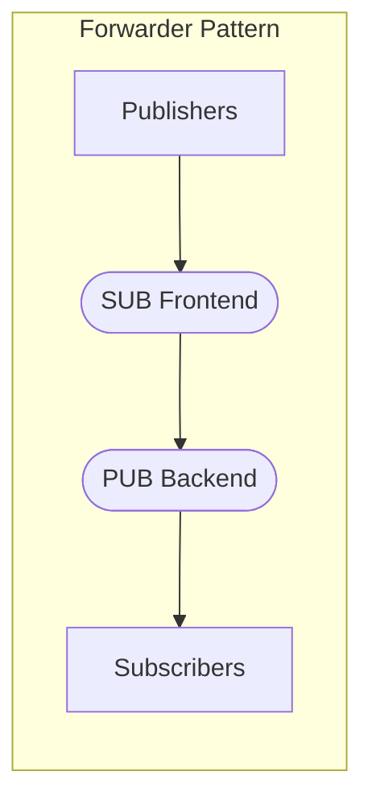
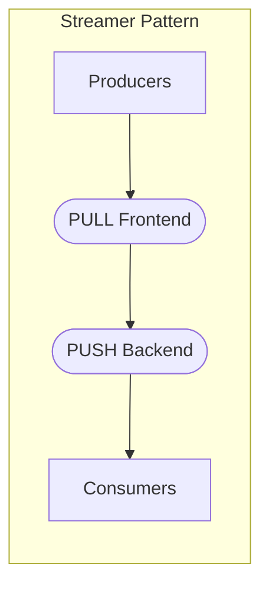

# Advanced Features in szq

This document covers advanced features of the szq library, including proxy devices, socket options, identity management, and CURVE security.

## Proxy Devices

ZeroMQ proxy devices (also known as "devices" or "queues") allow you to create intermediaries that connect multiple sockets. szq provides a `Proxy` class to make working with proxies easier.

### Proxy Patterns

szq supports the three standard ZeroMQ proxy patterns:

1. **Queue (ROUTER-DEALER)** - For request-reply patterns
2. **Forwarder (SUB-PUB)** - For publish-subscribe patterns
3. **Streamer (PULL-PUSH)** - For pipeline patterns







### Creating a Proxy

You can create a proxy using the helper methods in the `ProxyPattern` enum:

```swift
import szq
import Foundation

let context = Context()

do {
    // Create a queue device (ROUTER-DEALER)
    let queue = try ProxyPattern.queue.createProxy(
        context: context,
        frontendUrl: "tcp://*:5559",
        backendUrl: "tcp://*:5560"
    )
    
    // Start the proxy in a separate thread
    try queue.start()
    
    print("Queue device started. Press any key to stop...")
    // Wait for user input
    _ = readLine()
    
    // Stop the proxy
    try queue.stop()
    
} catch {
    print("Error: \(error)")
}
```

### Manual Proxy Setup

You can also set up proxies manually for more control:

```swift
import szq
import Foundation

let context = Context()

do {
    // Create frontend and backend sockets
    let frontend = try context.bind(type: .router, url: "tcp://*:5559")
    let backend = try context.bind(type: .dealer, url: "tcp://*:5560")
    
    // Optional capture socket for monitoring
    let capture = try context.bind(type: .pub, url: "tcp://*:5561")
    
    // Create a proxy
    let proxy = Proxy(context: context, frontend: frontend, backend: backend, capture: capture)
    
    // Start the proxy in a separate thread
    try proxy.start()
    
    print("Proxy started. Press any key to stop...")
    // Wait for user input
    _ = readLine()
    
    // Stop the proxy
    try proxy.stop()
    
} catch {
    print("Error: \(error)")
}
```

## Socket Options

szq provides a comprehensive set of socket options for fine-tuning socket behavior. Here are some examples of how to use various socket options:

### High Water Mark Options

```swift
// Set send high water mark (default: 1000)
try socket.setSendHighWaterMark(2000)

// Set receive high water mark
try socket.setReceiveHighWaterMark(5000)

// Get current high water marks
let sendHwm = try socket.getSendHighWaterMark()
let recvHwm = try socket.getReceiveHighWaterMark()
print("Send HWM: \(sendHwm), Receive HWM: \(recvHwm)")
```

### Timeout Options

```swift
// Set send timeout (in milliseconds)
try socket.setSendTimeout(milliseconds: 1000) // 1 second

// Set receive timeout
try socket.setReceiveTimeout(milliseconds: 2000) // 2 seconds

// Get current timeout values
let sendTimeout = try socket.getSendTimeout()
let recvTimeout = try socket.getReceiveTimeout()
print("Send timeout: \(sendTimeout)ms, Receive timeout: \(recvTimeout)ms")
```

### Reconnection Options

```swift
// Set reconnection interval (default: 100ms)
try socket.setReconnectInterval(milliseconds: 200)

// Set maximum reconnection interval (for exponential backoff)
try socket.setMaxReconnectInterval(milliseconds: 10000) // 10 seconds

// Get current reconnection settings
let reconnectInterval = try socket.getReconnectInterval()
let maxReconnectInterval = try socket.getMaxReconnectInterval()
print("Reconnect interval: \(reconnectInterval)ms, Max: \(maxReconnectInterval)ms")
```

### TCP Options

```swift
// Enable TCP keepalive
try socket.setTCPKeepAlive(1)

// Get TCP keepalive setting
let keepAlive = try socket.getTCPKeepAlive()
print("TCP Keepalive: \(keepAlive)")
```

### IP Version Options

```swift
// Enable IPv6 support
try socket.setIPv6(1)

// Alternatively, restrict to IPv4 only
try socket.setIPv4Only(1)

// Get current settings
let ipv6Enabled = try socket.getIPv6()
let ipv4Only = try socket.getIPv4Only()
print("IPv6 enabled: \(ipv6Enabled), IPv4 only: \(ipv4Only)")
```

### Connection Options

```swift
// Get the last endpoint bound/connected to
let lastEndpoint = try socket.getLastEndpoint()
print("Last endpoint: \(lastEndpoint)")

// Set handshake interval timeout (default: 30000ms)
try socket.setHandshakeInterval(milliseconds: 5000) // 5 seconds

// Set immediate mode (don't queue messages when no connection)
try socket.setImmediate(1)
```

### Socket Information

```swift
// Get the socket type
let socketType = try socket.getType()
print("Socket type: \(socketType)")

// Check for events (ZMQ_POLLIN, ZMQ_POLLOUT)
let events = try socket.getEvents()
let canRead = events & ZMQ_POLLIN != 0
let canWrite = events & ZMQ_POLLOUT != 0
print("Can read: \(canRead), Can write: \(canWrite)")
```

### Multicast Options

```swift
// Set multicast hops (default: 1)
try socket.setMulticastHops(5)

// Set multicast data rate (kilobits per second)
try socket.setMulticastRate(1000) // 1 Mbps

// Set multicast recovery interval
try socket.setMulticastRecoveryInterval(milliseconds: 10000) // 10 seconds

// Get current settings
let hops = try socket.getMulticastHops()
let rate = try socket.getMulticastRate()
let recoveryInterval = try socket.getMulticastRecoveryInterval()
print("Multicast settings - Hops: \(hops), Rate: \(rate) Kbps, Recovery: \(recoveryInterval)ms")
```

### Message Size Options

```swift
// Set maximum message size (bytes, default: no limit)
try socket.setMaxMessageSize(1_000_000) // ~1 MB

// Get maximum message size
let maxSize = try socket.getMaxMessageSize()
print("Maximum message size: \(maxSize) bytes")
```

### Connection Backlog

```swift
// Set connection backlog (default: 100)
try socket.setBacklog(200)

// Get connection backlog
let backlog = try socket.getBacklog()
print("Connection backlog: \(backlog)")
```

### PUB/SUB Socket Options

```swift
// For PUB sockets: Set conflate option (only keep most recent message)
try pubSocket.setConflate(1)

// For SUB sockets: Subscribe to topic(s)
try subSocket.subscribe(prefix: "topic1")
try subSocket.subscribe(prefix: "topic2")

// For SUB sockets: Unsubscribe from topic
try subSocket.unsubscribe(prefix: "topic1")

// Subscribe to everything (empty prefix)
try subSocket.subscribe(prefix: "")
```

### ROUTER/DEALER Socket Options

```swift
// For ROUTER: Make ROUTER mandatory (don't drop unroutable messages)
try routerSocket.setRouterMandatory(1)

// For ROUTER: Enable ROUTER handover for peer identities
try routerSocket.setRouterHandover(1)

// For ROUTER: Use raw identities (no automatic UUIDs)
try routerSocket.setRouterRaw(1)
```

### Proxy Settings

```swift
// Set SOCKS5 proxy address
try socket.setProxy("tcp://proxy.example.com:1080")

// Set SOCKS5 authentication
try socket.setSocks5Username("username")
try socket.setSocks5Password("password")

// Get current proxy address
if let proxyAddress = try socket.getProxy() {
    print("Using proxy: \(proxyAddress)")
} else {
    print("No proxy configured")
}
```

### Thread Affinity

```swift
// Set thread affinity (bitmask, default: all threads)
try socket.setAffinity(1) // Only use thread 0

// Get thread affinity
let affinity = try socket.getAffinity()
print("Thread affinity: \(affinity)")
```

### Linger Period

```swift
// Set linger period for socket close (default: -1, wait forever)
try socket.linger(milliseconds: 1000) // Wait up to 1 second

// Get current linger period
let linger = try socket.linger()
print("Linger period: \(linger)ms")
```

## Identity Management

ZeroMQ sockets, especially ROUTER and DEALER sockets, can use identities to route messages. szq provides methods to set and get socket identities:

```swift
import szq

let context = Context()

do {
    // Create a DEALER socket
    let dealer = try context.connect(type: .dealer, url: "tcp://localhost:5559")
    
    // Set an identity (must be 1-255 bytes)
    try dealer.setIdentity("client123")
    
    // Get the current identity
    let identity = try dealer.getIdentity()
    print("Socket identity size: \(identity.size) bytes")
    
    // Converting identity to string (if it's ASCII)
    if let identityString = identity.string {
        print("Socket identity: \(identityString)")
    }
    
    // You can also set a binary identity
    try dealer.setIdentity([0x01, 0x02, 0x03, 0x04, 0x05], size: 5)
    
} catch {
    print("Error: \(error)")
}
```

### ROUTER Socket with Identities

```swift
import szq

let context = Context()

do {
    // Create a ROUTER socket
    let router = try context.bind(type: .router, url: "tcp://*:5560")
    
    print("Router waiting for messages...")
    
    while true {
        // Receive a message (identity frame + content)
        guard let frames = try router.recvAll() else {
            continue
        }
        
        // The first frame is the identity
        let clientIdentity = frames[0]
        
        // The rest are the actual message parts
        let messageParts = Array(frames.dropFirst())
        
        print("Received message from client with \(clientIdentity.size) byte identity")
        
        // Process the message...
        
        // Send a reply to that specific client
        var reply = [clientIdentity] // Start with identity frame
        reply.append(try Message(string: "Reply"))
        
        // Send all frames
        for (index, frame) in reply.enumerated() {
            let isLast = index == reply.count - 1
            if isLast {
                try router.send(frame)
            } else {
                try router.send(frame, dontwait: false)
            }
        }
    }
    
} catch {
    print("Error: \(error)")
}
```

## CURVE Security

ZeroMQ CURVE security provides strong encryption based on the CurveZMQ protocol (an implementation of CurveCP). szq provides comprehensive support for CURVE security:

### Generate Key Pairs

```swift
import szq

// Generate a CURVE key pair
if let (publicKey, secretKey) = Z85.generateKeyPair() {
    print("Public key: \(publicKey)")
    print("Secret key: \(secretKey)")
} else {
    print("Failed to generate keys")
}
```

### Server Configuration

```swift
import szq

let context = Context()

do {
    // Create a server socket (e.g., REP)
    let server = try context.bind(type: .rep, url: "tcp://*:5561")
    
    // Generate keys
    guard let (publicKey, secretKey) = Z85.generateKeyPair() else {
        print("Failed to generate keys")
        return
    }
    
    print("Server public key: \(publicKey)")
    
    // Set up CURVE security on the server
    try server.setCurveServer(1) // Enable CURVE security in server mode
    try server.setCurvePublicKey(publicKey)
    try server.setCurveSecretKey(secretKey)
    
    print("Server ready with CURVE security")
    
    // Normal socket operations...
    
} catch {
    print("Error: \(error)")
}
```

### Client Configuration

```swift
import szq

let context = Context()

do {
    // Server's public key (must be known in advance)
    let serverPublicKey = "rq:rM>}U?@Lns47E1%kR.o@n%FcmmsL/@{H8]yf7"
    
    // Create a client socket (e.g., REQ)
    let client = try context.connect(type: .req, url: "tcp://localhost:5561")
    
    // Generate client keys
    guard let (clientPublicKey, clientSecretKey) = Z85.generateKeyPair() else {
        print("Failed to generate keys")
        return
    }
    
    // Set up CURVE security on the client
    try client.setCurvePublicKey(clientPublicKey)
    try client.setCurveSecretKey(clientSecretKey)
    try client.setCurveServerKey(serverPublicKey) // Must know the server's public key
    
    print("Client connected with CURVE security")
    
    // Normal socket operations...
    
} catch {
    print("Error: \(error)")
}
```

### Z85 Encoding and Decoding

```swift
import szq

// Binary data to encode
let binaryData: [UInt8] = [0, 1, 2, 3, 4, 5, 6, 7, 8, 9, 10, 11, 12, 13, 14, 15]

// Encode to Z85
if let encoded = Z85.encode(binaryData) {
    print("Z85 encoded: \(encoded)")
    
    // Decode back to binary
    if let decoded = Z85.decode(encoded) {
        print("Decoded correctly: \(binaryData == decoded)")
    }
}
```