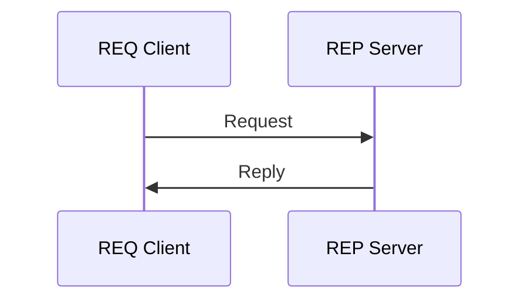
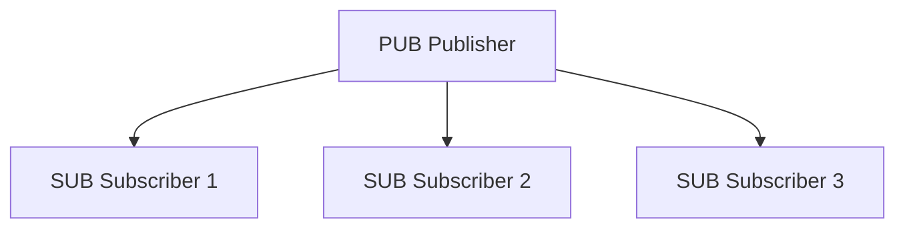
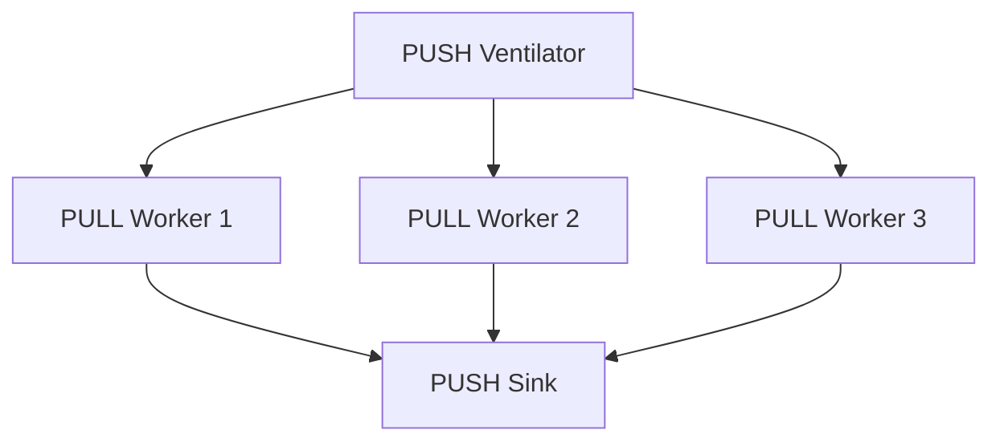
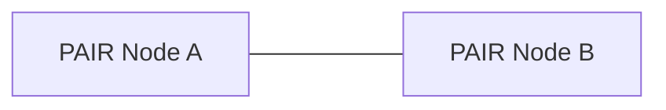

# Basic ZeroMQ Patterns with szq

ZeroMQ supports several fundamental messaging patterns. This document shows how to implement each of these patterns with szq.

## Request-Reply Pattern

The request-reply pattern is a simple pattern where a client sends a request, and a server sends back a reply.



### Server (REP)

```swift
import szq
import Foundation

let context = Context()

// Create a REP socket (server)
let server = try context.bind(type: .rep, url: "tcp://*:5555")

print("Server started, waiting for requests...")

while true {
    // Wait for a request
    guard let messages = try server.recvAll() else {
        print("No message received")
        continue
    }
    
    // Print the request
    if let requestString = messages[0].string {
        print("Received request: \(requestString)")
    }
    
    // Sleep to simulate work
    Thread.sleep(forTimeInterval: 1)
    
    // Send a reply
    try server.send(Message(string: "World"))
}
```

### Client (REQ)

```swift
import szq

let context = Context()

// Create a REQ socket (client)
let client = try context.connect(type: .req, url: "tcp://localhost:5555")

// Send a request
try client.send(Message(string: "Hello"))

// Wait for a reply
if let messages = try client.recvAll(), let replyString = messages[0].string {
    print("Received reply: \(replyString)")
}
```

## Publish-Subscribe Pattern

The publish-subscribe pattern allows a publisher to send messages to multiple subscribers.



### Publisher (PUB)

```swift
import szq
import Foundation

let context = Context()

// Create a PUB socket
let publisher = try context.bind(type: .pub, url: "tcp://*:5556")

print("Publisher started, sending updates...")

var updateNumber = 0
while true {
    // Create update categories
    let categories = ["sports", "weather", "news"]
    let category = categories[updateNumber % categories.count]
    
    // Create update message
    let message = "[\(category)] Update #\(updateNumber)"
    
    // Publish the message with a topic prefix
    try publisher.send(Message(string: "\(category) \(message)"))
    print("Published: \(message)")
    
    updateNumber += 1
    Thread.sleep(forTimeInterval: 1)
}
```

### Subscriber (SUB)

```swift
import szq

let context = Context()

// Create a SUB socket
let subscriber = try context.connect(type: .sub, url: "tcp://localhost:5556")

// Subscribe to topics (can be multiple)
if let topicToSubscribe = CommandLine.arguments.dropFirst().first {
    try subscriber.subscribe(prefix: topicToSubscribe)
    print("Subscribed to: \(topicToSubscribe)")
} else {
    // Subscribe to all messages if no topic specified
    try subscriber.subscribe(prefix: "")
    print("Subscribed to all messages")
}

print("Subscriber started, waiting for updates...")

while true {
    // Wait for a message
    if let messages = try subscriber.recvAll(), let updateString = messages[0].string {
        print("Received: \(updateString)")
    }
}
```

## Push-Pull Pattern (Pipeline)

The push-pull pattern distributes tasks among workers.



### Ventilator (PUSH)

```swift
import szq
import Foundation

let context = Context()

// Create a PUSH socket
let ventilator = try context.bind(type: .push, url: "tcp://*:5557")

print("Ventilator ready to send tasks...")

// Wait a bit for workers to connect
Thread.sleep(forTimeInterval: 1)

// Send tasks
let totalTasks = 100
print("Sending \(totalTasks) tasks...")

for taskNumber in 0..<totalTasks {
    // Simulate different workloads (10-100ms)
    let workload = Int.random(in: 10...100)
    
    // Send task with workload
    try ventilator.send(Message(string: "\(workload)"))
    
    if taskNumber % 10 == 0 {
        print("Sent \(taskNumber) tasks...")
    }
}

print("All tasks sent!")
```

### Worker (PULL -> PUSH)

```swift
import szq
import Foundation

let context = Context()

// Connect to the ventilator
let receiver = try context.connect(type: .pull, url: "tcp://localhost:5557")

// Connect to the sink
let sender = try context.connect(type: .push, url: "tcp://localhost:5558")

print("Worker ready to receive tasks...")

while true {
    // Receive a task
    guard let messages = try receiver.recvAll(),
          let workloadString = messages[0].string,
          let workload = Int(workloadString) else {
        continue
    }
    
    // Simulate work
    print("Received task: \(workload)ms")
    Thread.sleep(forTimeInterval: Double(workload) / 1000)
    
    // Send result to sink
    try sender.send(Message())
}
```

### Sink (PULL)

```swift
import szq
import Foundation

let context = Context()

// Create a PULL socket
let sink = try context.bind(type: .pull, url: "tcp://*:5558")

print("Sink started, waiting for results...")

// Wait for results
let totalTasks = 100
let startTime = Date()

for taskNumber in 0..<totalTasks {
    // Wait for a result
    let _ = try sink.recv()
    
    if taskNumber % 10 == 0 {
        let percentage = Double(taskNumber) / Double(totalTasks) * 100
        print("Received \(taskNumber) results (\(Int(percentage))%)...")
    }
}

let duration = Date().timeIntervalSince(startTime)
print("All results received in \(duration) seconds!")
```

## Exclusive Pair Pattern

The exclusive pair pattern creates a dedicated connection between two peers.



### Node A (PAIR)

```swift
import szq
import Foundation

let context = Context()

// Create a PAIR socket
let socket = try context.bind(type: .pair, url: "tcp://*:5559")

print("Node A started...")

// Alternate between sending and receiving
for i in 0..<10 {
    // Send a message
    try socket.send(Message(string: "Message \(i) from Node A"))
    print("Sent message to Node B")
    
    // Wait for a reply
    if let messages = try socket.recvAll(), let replyString = messages[0].string {
        print("Received from Node B: \(replyString)")
    }
    
    Thread.sleep(forTimeInterval: 1)
}
```

### Node B (PAIR)

```swift
import szq
import Foundation

let context = Context()

// Create a PAIR socket
let socket = try context.connect(type: .pair, url: "tcp://localhost:5559")

print("Node B started...")

// Alternate between receiving and sending
for _ in 0..<10 {
    // Wait for a message
    if let messages = try socket.recvAll(), let messageString = messages[0].string {
        print("Received from Node A: \(messageString)")
    }
    
    // Send a reply
    try socket.send(Message(string: "Reply from Node B"))
    print("Sent reply to Node A")
    
    Thread.sleep(forTimeInterval: 1)
}
```

## Multipart Messages

ZeroMQ allows sending multipart messages, which are useful for implementing protocols and message frames:

```swift
// Sending multipart messages
try socket.send(Message(string: "Header"), Message(string: "Content"), Message(bytes: [1, 2, 3, 4]))

// Receiving multipart messages
if let frames = try socket.recvAll() {
    print("Received \(frames.count) message frames")
    
    for (index, frame) in frames.enumerated() {
        if let stringData = frame.string {
            print("Frame \(index): \(stringData)")
        } else {
            print("Frame \(index): Binary data of size \(frame.size)")
        }
    }
}
```