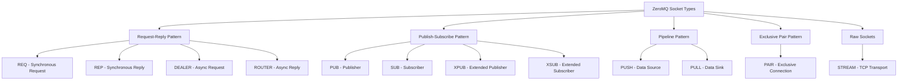

# ZeroMQ Socket Types in szq

ZeroMQ defines several socket types, each with specific behavior and purpose. This document explains each socket type and shows how to use them with szq.

## Overview of Socket Types



## Request-Reply Pattern Socket Types

### REQ Socket

REQ sockets implement a synchronous request-reply pattern where each request must be followed by receiving a reply.

**Key characteristics:**
- Automatically adds an empty delimiter frame
- Alternates between sending and receiving (send, receive, send, receive)
- Cannot send multiple requests without receiving replies in between

```swift
import szq

let context = Context()

do {
    let client = try context.connect(type: .req, url: "tcp://localhost:5555")
    
    // Send a request
    try client.send(Message(string: "Hello"))
    
    // Wait for reply
    if let reply = try client.recv() {
        print("Received reply: \(reply.string ?? "binary data")")
    }
    
    // This would fail (must receive before sending again):
    // try client.send(Message(string: "Another request"))
    
} catch {
    print("Error: \(error)")
}
```

### REP Socket

REP sockets implement the other side of the synchronous request-reply pattern, where each reply must be preceded by receiving a request.

**Key characteristics:**
- Automatically removes the empty delimiter frame from requests
- Alternates between receiving and sending (receive, send, receive, send)
- Cannot send replies without receiving requests first

```swift
import szq

let context = Context()

do {
    let server = try context.bind(type: .rep, url: "tcp://*:5555")
    
    print("Server listening...")
    
    while true {
        // Wait for a request
        if let request = try server.recv() {
            print("Received request: \(request.string ?? "binary data")")
            
            // Send a reply
            try server.send(Message(string: "World"))
            
            // This would fail (must receive before sending again):
            // try server.send(Message(string: "Another reply"))
        }
    }
    
} catch {
    print("Error: \(error)")
}
```

### DEALER Socket

DEALER sockets implement asynchronous request distribution to multiple REP or ROUTER sockets.

**Key characteristics:**
- Load balances outgoing messages across all connections
- Can send multiple messages without waiting for replies
- Does not enforce request-reply state machine

```swift
import szq

let context = Context()

do {
    let client = try context.connect(type: .dealer, url: "tcp://localhost:5556")
    
    // Optional: Set an identity
    try client.setIdentity("client-123")
    
    // Need to send an empty frame first (for compatibility with REP sockets)
    for i in 1...10 {
        // Send an empty frame followed by the request
        try client.send(Message(), Message(string: "Request \(i)"))
        print("Sent request \(i)")
    }
    
    // Can asynchronously receive replies
    for _ in 1...10 {
        if let frames = try client.recvAll(), frames.count >= 2 {
            // First frame should be empty, second contains the reply
            if let replyString = frames[1].string {
                print("Received reply: \(replyString)")
            }
        }
    }
    
} catch {
    print("Error: \(error)")
}
```

### ROUTER Socket

ROUTER sockets implement message distribution based on identities, typically received from DEALER or REQ sockets.

**Key characteristics:**
- Adds an identity frame to received messages
- Routes outgoing messages to specific peer connections based on identity
- Maintains a mapping of identities to connections
- Provides advanced request-reply routing capabilities

```swift
import szq

let context = Context()

do {
    let server = try context.bind(type: .router, url: "tcp://*:5556")
    
    print("Router listening...")
    
    // Maps to store client identities and pending requests
    var clients: [Data: Int] = [:]
    
    while true {
        // Receive message (identity frame + empty delimiter + request)
        guard let frames = try server.recvAll(), frames.count >= 3 else {
            continue
        }
        
        // First frame is the client identity
        let identity = frames[0]
        
        // Third frame is the actual request
        if let requestString = frames[2].string {
            print("Received request from client: \(requestString)")
            
            // Track the client
            let clientId = Data(bytes: identity.data!, count: identity.size)
            let requestCount = (clients[clientId] ?? 0) + 1
            clients[clientId] = requestCount
            
            // Send a reply back to this specific client
            try server.send(identity, Message(), Message(string: "Reply \(requestCount)"))
        }
    }
    
} catch {
    print("Error: \(error)")
}
```

## Publish-Subscribe Pattern Socket Types

### PUB Socket

PUB sockets implement one-way data distribution to multiple subscribers.

**Key characteristics:**
- One-to-many distribution pattern
- Fire-and-forget (no delivery guarantees)
- No built-in acknowledgments
- Subscribers can filter messages by prefix

```swift
import szq
import Foundation

let context = Context()

do {
    let publisher = try context.bind(type: .pub, url: "tcp://*:5557")
    
    print("Publisher started...")
    
    var counter = 0
    while true {
        // Send messages with different topics
        let topics = ["sports", "weather", "news"]
        
        for topic in topics {
            let message = "\(topic) update \(counter)"
            try publisher.send(Message(string: message))
            print("Published: \(message)")
        }
        
        counter += 1
        Thread.sleep(forTimeInterval: 1)
    }
    
} catch {
    print("Error: \(error)")
}
```

### SUB Socket

SUB sockets receive messages from publishers based on subscription filters.

**Key characteristics:**
- Subscribes to specific message prefixes/topics
- Can subscribe to multiple topics
- Can subscribe to all messages with an empty prefix
- Only receives messages, cannot send

```swift
import szq

let context = Context()

do {
    let subscriber = try context.connect(type: .sub, url: "tcp://localhost:5557")
    
    // Subscribe to specific topics
    try subscriber.subscribe(prefix: "weather")
    
    // To subscribe to multiple topics:
    // try subscriber.subscribe(prefix: "sports")
    
    // To subscribe to all messages:
    // try subscriber.subscribe(prefix: "")
    
    print("Subscriber listening for weather updates...")
    
    while true {
        // Receive messages
        if let message = try subscriber.recv(), let text = message.string {
            print("Received: \(text)")
        }
    }
    
} catch {
    print("Error: \(error)")
}
```

### XPUB and XSUB Sockets

XPUB and XSUB are extended versions of PUB and SUB that expose subscription messages, useful for building proxy devices.

**XPUB characteristics:**
- Works like PUB but also sends subscription notifications
- Receives subscribe/unsubscribe messages when clients subscribe/unsubscribe
- Used to build pub-sub proxies

**XSUB characteristics:**
- Works like SUB but also forwards subscription requests
- Allows sending subscribe/unsubscribe messages
- Used to build pub-sub proxies

Example of a pub-sub forwarder:

```swift
import szq

let context = Context()

do {
    // Create XSUB socket to receive from publishers
    let xsub = try context.bind(type: .xsub, url: "tcp://*:5558")
    
    // Create XPUB socket to send to subscribers
    let xpub = try context.bind(type: .xpub, url: "tcp://*:5559")
    
    print("Starting pub-sub forwarder...")
    
    // Use the built-in proxy function to forward messages
    try context.proxy(frontend: xsub, backend: xpub)
    
    // The proxy function blocks until interrupted
    
} catch {
    print("Error: \(error)")
}
```

## Pipeline Pattern Socket Types

### PUSH Socket

PUSH sockets distribute messages to PULL sockets in a round-robin fashion.

**Key characteristics:**
- Distributes outgoing messages among all connected peers
- Uses a fair-queuing algorithm
- Only sends messages, cannot receive
- Load balancing between multiple receivers

```swift
import szq
import Foundation

let context = Context()

do {
    let pusher = try context.bind(type: .push, url: "tcp://*:5560")
    
    print("Push socket ready...")
    
    // Wait for workers to connect
    Thread.sleep(forTimeInterval: 1)
    
    // Send tasks to workers
    for i in 1...100 {
        let task = "Task \(i)"
        try pusher.send(Message(string: task))
        print("Sent: \(task)")
        
        Thread.sleep(forTimeInterval: 0.01)
    }
    
    print("All tasks sent")
    
} catch {
    print("Error: \(error)")
}
```

### PULL Socket

PULL sockets receive messages from PUSH sockets.

**Key characteristics:**
- Receives messages from PUSH sockets
- Fair queuing from multiple senders
- Only receives messages, cannot send
- Used as the sink in pipeline patterns

```swift
import szq

let context = Context()

do {
    let puller = try context.connect(type: .pull, url: "tcp://localhost:5560")
    
    print("Pull socket ready, waiting for tasks...")
    
    var tasksReceived = 0
    
    while true {
        // Receive a task
        if let message = try puller.recv(), let task = message.string {
            tasksReceived += 1
            print("Received task: \(task)")
            
            // Process the task...
            Thread.sleep(forTimeInterval: 0.05)
            
            print("Completed \(tasksReceived) tasks")
        }
    }
    
} catch {
    print("Error: \(error)")
}
```

## Exclusive Pair Pattern

### PAIR Socket

PAIR sockets create an exclusive connection between two endpoints.

**Key characteristics:**
- One-to-one connection
- Both sides can send and receive
- No automatic reconnection
- Best for connecting two threads in the same process

```swift
import szq
import Foundation

let context = Context()

do {
    // This could be in thread A
    let socket = try context.bind(type: .pair, url: "inproc://example")
    
    // In another thread, would be:
    // let socket = try context.connect(type: .pair, url: "inproc://example")
    
    print("PAIR socket ready...")
    
    // Sending
    try socket.send(Message(string: "Hello from this thread"))
    
    // Receiving
    if let message = try socket.recv(), let text = message.string {
        print("Received: \(text)")
    }
    
} catch {
    print("Error: \(error)")
}
```

## Raw Socket Type

### STREAM Socket

STREAM sockets allow working with raw TCP connections.

**Key characteristics:**
- Communicates with non-ZeroMQ peers
- Bi-directional TCP communication
- Each received message has a connection identity prefix
- Useful for implementing non-ZeroMQ protocols

```swift
import szq
import Foundation

let context = Context()

do {
    let socket = try context.bind(type: .stream, url: "tcp://*:5562")
    
    print("STREAM socket bound, waiting for connections...")
    
    while true {
        // Receive a message
        guard let frames = try socket.recvAll(), frames.count >= 2 else {
            continue
        }
        
        // First frame is connection identity
        let identity = frames[0]
        
        // Second frame is data (may be empty when a new connection is established)
        if frames[1].size > 0, let data = frames[1].string {
            print("Received data: \(data)")
            
            // Send a response (must include the identity frame first)
            try socket.send(identity, Message(string: "HTTP/1.1 200 OK\r\nContent-Length: 12\r\n\r\nHello World!"))
        } else {
            print("New connection established")
        }
    }
    
} catch {
    print("Error: \(error)")
}
```

## Socket Type Combinations

Not all socket types can be meaningfully connected to each other. Here's a table of valid socket combinations:

```
| From/To | REQ | REP | DEALER | ROUTER | PUB | SUB | PUSH | PULL | PAIR |
|---------|-----|-----|--------|--------|-----|-----|------|------|------|
| REQ     |     |  ✓  |        |   ✓    |     |     |      |      |      |
| REP     |  ✓  |     |   ✓    |        |     |     |      |      |      |
| DEALER  |     |  ✓  |   ✓    |   ✓    |     |     |      |      |      |
| ROUTER  |  ✓  |     |   ✓    |   ✓    |     |     |      |      |      |
| PUB     |     |     |        |        |     |  ✓  |      |      |      |
| SUB     |     |     |        |        |  ✓  |     |      |      |      |
| PUSH    |     |     |        |        |     |     |      |  ✓   |      |
| PULL    |     |     |        |        |     |     |  ✓   |      |      |
| PAIR    |     |     |        |        |     |     |      |      |  ✓   |
```